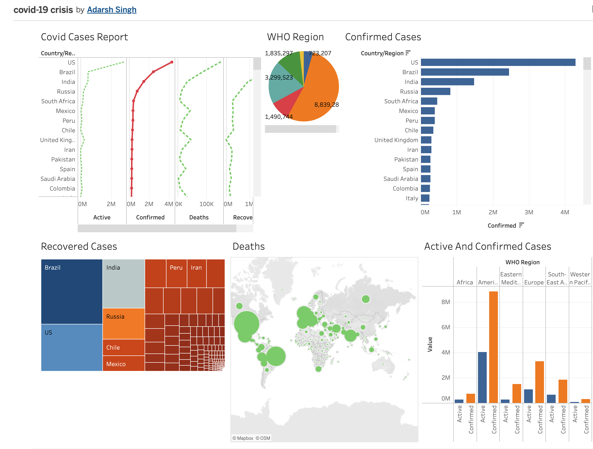

# COVID-19-crisisDashboard (Tableau)

## 📊 Project Overview
This project is an interactive COVID-19 dashboard built using Tableau to analyze global pandemic trends.

## 🚀 Features
- Global case analysis
- Vaccination tracking
- Regional insights and trends

## 🛠️ Tools Used
- Tableau
- Data Visualization

## 🔗 Live Dashboard
https://public.tableau.com/app/profile/adarsh.singh6059/viz/covid-19crisis/Covid-19

## 📸 Dashboard Preview

